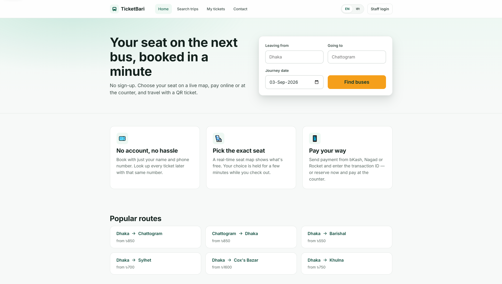
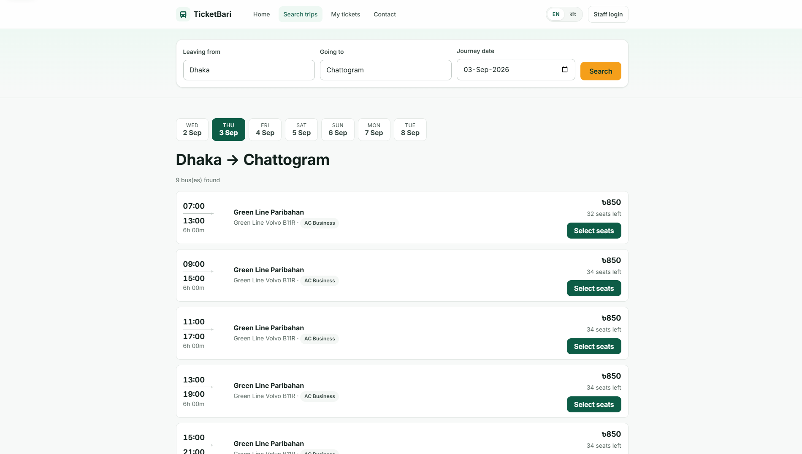
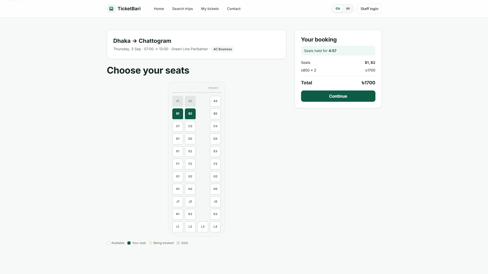
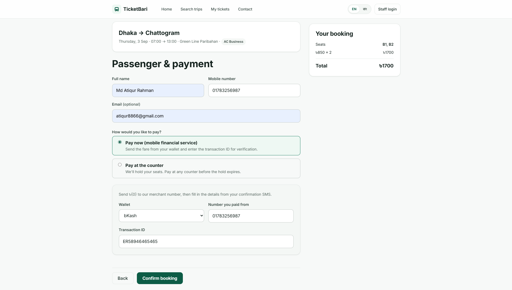
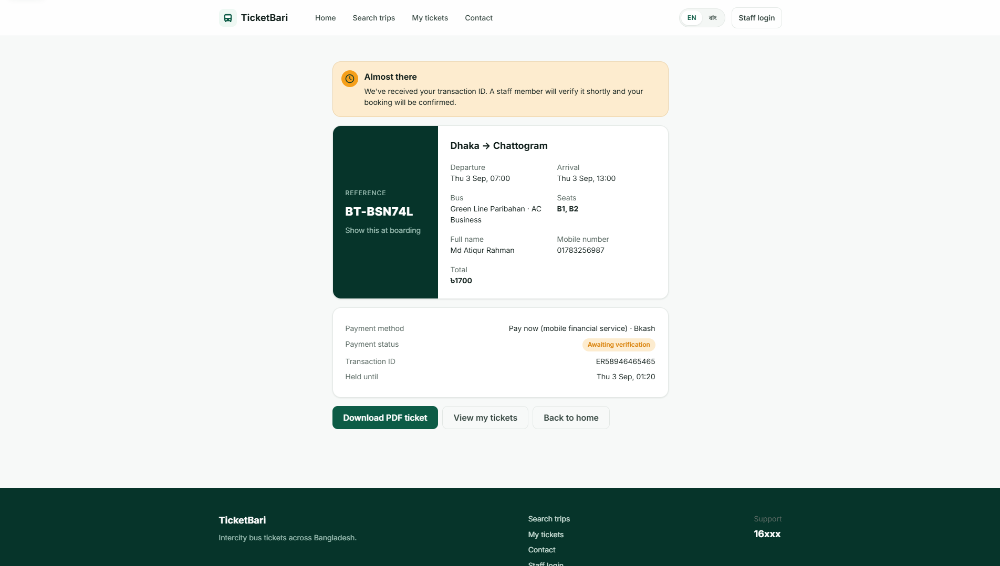
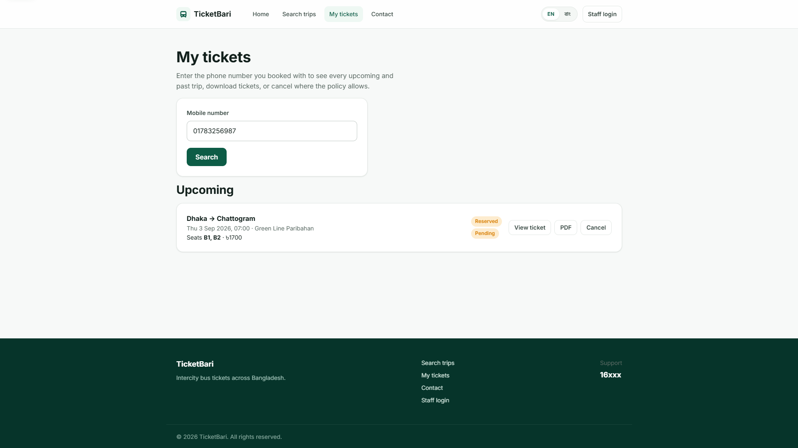
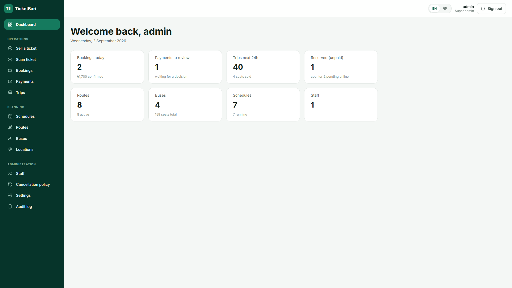
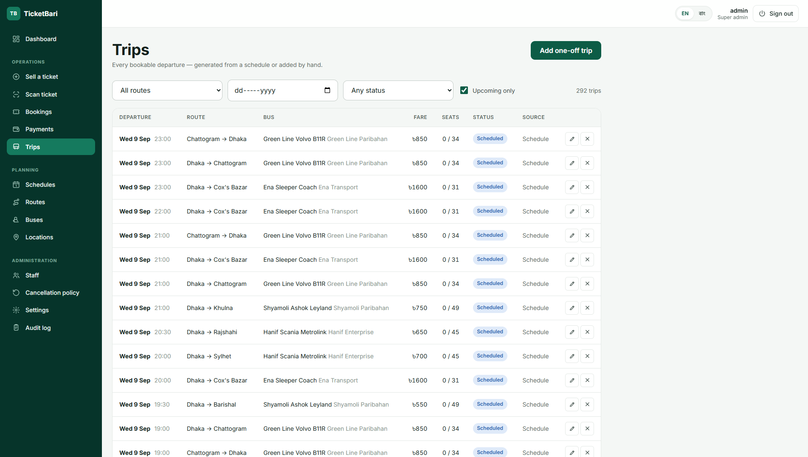

<div align="center">

# 🚌 TicketBari

**A mobile-first intercity bus ticket booking platform for Bangladesh.**

Passengers book without an account — name and phone only. Counter staff and
administrators run the back office from the same app. English and বাংলা
throughout.


</div>

---

## Contents

**Get started** — [Features](#-features) · [Screenshots](#-screenshots) · [Tech stack](#-tech-stack) · [Quick start](#-quick-start) · [Sample data](#-sample-data)

**Reference** — [Configuration](#-configuration) · [Project structure](#-project-structure) · [Roadmap](#-roadmap) · [Architecture](#-architecture) · [Database](#-database-and-migrations) · [Deployment](#-deployment)

---

## ✨ Features

### For passengers — no account, just a phone number

- **Search** intercity trips by route and date, with a rolling day selector.
- **Live seat map** — pick your exact seat. It's held for a few minutes while
  you check out, with a visible countdown, and other people see it as taken in
  real time.
- **Pay your way** — send the fare from a mobile wallet (bKash / Nagad / Rocket)
  and submit the transaction ID for verification, or reserve now and pay at the
  counter.
- **QR e-ticket** — a booking reference plus a downloadable PDF and an SMS link.
- **My Tickets** — look up every past and upcoming trip by phone number, to
  re-download a ticket or cancel within the refund policy.
- Every screen available in **English or বাংলা**.

### For counter staff

- Sell tickets to walk-in passengers through the same seat-hold flow.
- Record cash or mobile-wallet payments taken in person.
- Review, verify, or reject the online payments customers submit.
- Search and filter every booking; cancel with a logged reason.
- Scan a boarding-pass QR at the door for a valid / invalid verdict.

### For administrators

- **Fleet** — buses with a visual seat-layout editor, operator, and class.
- **Routes** built from a pre-loaded list of 64 districts and curated terminals.
- **Recurring schedules** — define a departure pattern per route and the engine
  auto-generates a rolling 7-day window of bookable trips.
- Manual and one-off trips, cancellations, and status overrides.
- A **cancellation & refund policy** engine, tiered by hours before departure.
- Staff accounts with roles and counter assignment.
- Platform settings and a full **audit log** of every back-office action.

### Platform

- One **ASP.NET Core Blazor Server** app — a single deployable, no separate SPA.
- **PostgreSQL** with UTF-8 enforced so Bangla text is never mangled.
- Real-time seat locking with **no SignalR hub**; `xmin` optimistic concurrency
  is the real guard against a double-book.
- Background workers for trip generation and hold / booking expiry.
- **Dockerised**, and ready to run behind nginx + TLS on a single VPS.
- Health probes, idempotent seeding, and a self-healing admin bootstrap.

---

## 📸 Screenshots

### Customer booking flow

<table>
  <tr>
    <td width="50%" valign="top">
      <b>1 · Find a bus</b><br>
      Search by route and date on the landing page — no sign-up.<br><br>
      
    </td>
    <td width="50%" valign="top">
      <b>2 · Choose the departure</b><br>
      Results for the day with a date strip and live seat counts.<br><br>
      
    </td>
  </tr>
  <tr>
    <td width="50%" valign="top">
      <b>3 · Pick seats on a live map</b><br>
      The choice is held while you check out; a countdown shows the time left.<br><br>
      
    </td>
    <td width="50%" valign="top">
      <b>4 · Passenger details and payment</b><br>
      Name and phone, then pay by mobile wallet or reserve for the counter.<br><br>
      
    </td>
  </tr>
  <tr>
    <td width="50%" valign="top">
      <b>5 · Get the ticket</b><br>
      A QR reference, a status banner while payment is verified, and a PDF.<br><br>
      
    </td>
    <td width="50%" valign="top">
      <b>6 · Come back any time</b><br>
      "My Tickets" finds every trip by phone number to re-download or cancel.<br><br>
      
    </td>
  </tr>
</table>

### Back office

<table>
  <tr>
    <td width="50%" valign="top">
      <b>Dashboard</b><br>
      The day at a glance — bookings, revenue, payments waiting, departures in
      24 hours, unpaid holds, and fleet counts.<br><br>
      
    </td>
    <td width="50%" valign="top">
      <b>Trips</b><br>
      Every bookable departure the schedule engine generated, filterable by
      route, date, and status.<br><br>
      
    </td>
  </tr>
</table>

---

## 🛠 Tech stack

| Layer | Choice |
|---|---|
| **Web (UI + API)** | ASP.NET Core **Blazor Server** — interactive server components where a screen needs live state, static SSR everywhere else |
| **Data** | **PostgreSQL 18** · EF Core 10 · Npgsql · snake_case schema |
| **Auth** | ASP.NET Core **Identity**, cookie auth — staff and admin only; passengers are just a phone number |
| **Realtime seat lock** | Blazor circuit + an in-process broadcast service; Postgres `xmin` row version is the real guard |
| **Background jobs** | `BackgroundService` + `PeriodicTimer` — trip generation, hold / booking sweeps |
| **i18n** | `.resx` resources (`SharedResource` + `.bn`), cookie-based culture, `/culture/set` |
| **PDF / QR** | QuestPDF + QRCoder, Hind Siliguri embedded for Bengali glyphs |
| **Packaging** | Multi-stage Docker image, `docker compose` for app + database |

> [!NOTE]
> The build differs from [`bus-ticketing-project-plan.md`](bus-ticketing-project-plan.md),
> which specified React + Spring Boot + MongoDB. The reasoning for each
> substitution is in [`docs/build-log.md`](docs/build-log.md#stack-decisions-differ-from-the-plan-document).

---

## 🚀 Quick start

### With Docker — nothing else to install

Needs only Docker (Desktop, or Engine + Compose v2).

```bash
cp .env.example .env          # then edit the passwords
docker compose up --build
```

| Service | URL | Notes |
|---|---|---|
| **App** | http://localhost:8080 | staff sign-in at `/staff/login` |
| **Database** | `localhost:5433` | user `postgres`, password from `.env` — for `psql` or a GUI |

On first boot the app creates the `busticketing` database **as UTF-8**, applies
migrations, and seeds the 64 districts and major terminals, the `admin` account,
default settings, and the standard cancellation policy.

```bash
docker compose logs -f app     # follow the app
docker compose down            # stop, keep data
docker compose down -v         # stop and wipe the database + key ring
```

<details>
<summary>What's in the two containers</summary>

- **`db`** — `postgres:18-alpine`, data on the `db-data` volume.
- **`app`** — the multi-stage [`Dockerfile`](Dockerfile): `dotnet publish` on the
  SDK image, then the ASP.NET runtime image (Debian, so ICU and tzdata are
  present for the `bn` culture and the `Asia/Dhaka` clock). Adds `libfontconfig1`
  for QuestPDF's renderer, runs as the non-root `app` user on port 8080, and
  keeps the data-protection key ring on the `dp-keys` volume so logins survive a
  redeploy.

</details>

### Local development

**Prerequisites** — .NET 10 SDK and PostgreSQL 14+ on `127.0.0.1:5432`. The
default connection string in [`appsettings.json`](appsettings.json) expects user
`postgres` with a blank password.

```bash
dotnet tool restore     # once — restores the pinned dotnet-ef
dotnet run
```

Open the URL it prints (`http://localhost:5258` by default). To point at a
different database, override the connection string with user secrets or a
git-ignored `appsettings.Local.json`:

```json
{ "ConnectionStrings": { "Postgres": "Host=…;Database=busticketing;Username=…;Password=…" } }
```

---

## 🌱 Sample data

A fresh database has locations and the `admin` account only — nothing bookable.
The **`seed-demo`** command loads a sample fleet, routes, schedules, and a week
of trips (4 buses of every class; 8 real corridors such as Dhaka ↔ Chattogram,
Sylhet, and Cox's Bazar; ~290 trips). It's idempotent — a no-op once a bus
exists.

| Where | Command |
|---|---|
| **Local, one-shot** | `dotnet run -- seed-demo` &nbsp;(seeds, prints a summary, exits) |
| **Docker, first boot** | set `SEED_DEMO=true` in `.env`, then `docker compose up --build` |
| **Docker, running stack** | `docker compose run --rm app seed-demo` |

Everything is created through the same code paths the admin UI uses, so the
trips appear in search and the whole booking flow works against them. Leave
`SEED_DEMO` unset for a real deployment.

---

## 🔧 Configuration

Standard ASP.NET configuration — `appsettings.json`, environment variables (`__`
for nesting), user secrets. The keys that matter:

| Key / env var | Default | Purpose |
|---|---|---|
| `ConnectionStrings__Postgres` | host Postgres, blank password | the database |
| `Seed__SuperAdminUsername` | `admin` | seeded on first boot |
| `Seed__SuperAdminPassword` | `ChangeMe!2026` | **change after first login** |
| `Seed__DemoData` | `false` | `true` loads the sample data on boot |
| `Localization__DefaultCulture` | `en` | `en` or `bn` |
| `Hosting__HttpsRedirection` | on outside Development | off in the container — nginx owns the redirect and HSTS |
| `DataProtection__KeyPath` | framework default | a mounted directory to persist the key ring |

Runtime, per-operator settings — seat-hold minutes, generation window, time
zone, currency, support phone, the public base URL for SMS links, and the
cancellation tiers — are edited in-app under **Settings** and **Cancellation
policy**, not in config files.

**Health probes:** `GET /healthz` (liveness), `GET /healthz/ready` (database
reachable).

---

## 📁 Project structure

```
Domain/                 Entities, enums, value objects — no framework dependencies
  Entity.cs               UUIDv7 key + timestamps base
  Bus · BusRoute · Trip · TripSeat · Booking · Payment · …
  SeatMap.cs              jsonb value object — the bus's physical layout
  CancellationPolicy.cs   tiered "hours before departure -> refund %"
  Enums.cs                TripStatus, BookingStatus, PaymentStatus, WeekDays …

Data/
  AppDbContext.cs         IdentityDbContext, snake_case, enums as strings
  Configurations/         one IEntityTypeConfiguration per aggregate + indexes
  Migrations/             EF Core migrations
  Seed/
    DatabaseInitializer   create DB (UTF-8) -> migrate -> seed roles/admin/settings
    LocationSeeder        64 districts + curated terminals, en + bn names
    DemoDataSeeder        optional sample fleet, routes, schedules, trips

Services/
  Admin/                  Location · Bus · Route · Staff · SeatMapFactory
  Auth/                   policies, revalidating auth-state provider
  Scheduling/             ScheduleTemplateService, TripGenerationService,
                          TripFactory, the background generator
  Booking/                TripSearchService, SeatHoldService, SeatMapBroadcaster,
                          BookingService, BookingAdminService, PaymentReviewService,
                          CancellationPolicyService, maintenance worker
  Ticketing/              QR + QuestPDF e-ticket, GET /tickets/{ref}.pdf
  Notifications/          ISmsSender seam, SmsService (+ SmsLog audit), templates
  SettingsService · AppClock · AuditService · OperationResult

Components/
  Layout/                 public shell, auth shell, admin shell (responsive drawer)
  Pages/                  Home, Search, BookTrip, BookingConfirmation, MyTickets, Contact
  Booking/                SeatChart, PaymentResubmit
  Account/                staff sign in / out
  Admin/                  back office, one folder per area (Buses, Routes,
                          Schedules, Trips, Bookings, Payments, Staff, Sell, …)
  Shared/Icon.razor       one stroke-icon set used across the admin

Resources/                SharedResource.resx (+ .bn), embedded Hind Siliguri .ttf
wwwroot/css/app.css       design system — tokens + primitives (component styles are scoped)

Dockerfile · docker-compose.yml · .dockerignore · .env.example
```

---

## 🗺 Roadmap

The [plan](bus-ticketing-project-plan.md) is seven phases. Progress against them:

| Phase | Scope | Status |
|---|---|:---:|
| **1 · Foundation** | Blazor Server + Postgres, domain model, auth, i18n, locations seed, design system | ✅ |
| **2 · Admin core** | Buses + seat-layout editor, routes, locations, staff, settings, audit log | ✅ |
| **3 · Schedule engine** | Schedule templates, rolling auto-generation, manual trips, status advance | ✅ |
| **4 · Public booking** | Search, live seat map + lock, booking, mFS + counter payment, staff verification, walk-in sell | ✅ |
| **5 · Tickets & customer** | My Tickets, QR / PDF e-ticket, SMS seam, cancellation-policy engine, boarding scan | ✅ |
| **6 · Reports & analytics** | Revenue / occupancy / payment-mix / cancellation reports, Excel export | ⏳ dashboard tiles done; reports pending |
| **7 · Hardening & deploy** | Rate limiting, CAPTCHA, SMS reminders, **Docker**, nginx + TLS | 🔶 Docker done; the rest pending |

Every phase closed with an end-to-end Playwright pass at phone and desktop
widths; [`docs/build-log.md`](docs/build-log.md) records what shipped and the
bugs found along the way.

**Roles:** *Customer* — no login, identified by phone. *Counter staff* — sell to
walk-ins, take offline payments, browse bookings. *Super admin* — everything:
fleet, routes, schedules, fares, staff, payments, refunds, settings, audit.

---

## 🏗 Architecture

- **Interactivity** — static SSR by default; islands of `InteractiveServer`
  (with `ServerNoPrerender` on forms, so hydration lag can't eat the first
  keystrokes) where a screen has live state. A page's `@rendermode` does **not**
  flow up to its layout.
- **Seat locking without SignalR** — `SeatMapBroadcaster` is an in-process
  pub/sub keyed by trip id. Every open seat map subscribes; a hold / release /
  book fires `Notify(tripId)` and the other circuits re-fetch. The guard against
  a double-book is the Postgres `xmin` row version on `trip_seats` — a concurrent
  write loses on `SaveChanges` and the caller retries.
- **Time** — `IAppClock` converts a platform-zone wall clock to a UTC instant;
  Npgsql `timestamptz` only accepts `DateTimeOffset` at offset 0.
- **Trip generation** — a `BackgroundService` tops up a rolling
  `GenerationWindowDays` horizon from active templates every few hours and
  advances `Scheduled -> Departed -> Completed` every 15 minutes. It never
  overwrites a hand-edited or cancelled trip.
- **Auditing** — every back-office mutation writes an `AuditLog` row; the writer
  never throws into the caller.
- **SMS** — `ISmsSender` is the single seam a real gateway plugs into. The
  default logs the message and records `Sent = false` rather than pretending to
  deliver; every attempt is persisted to `sms_logs`.

---

## 🗄 Database and migrations

`dotnet-ef` is a pinned local tool. Migrations also apply automatically on
startup (`DatabaseInitializer`), so a fresh environment needs no manual step.

```bash
dotnet tool restore
dotnet ef migrations add <Name> --output-dir Data/Migrations
dotnet ef database update
```

The database is created as **UTF-8 / C locale** explicitly — the initializer
connects to the `postgres` database first and runs
`CREATE DATABASE … ENCODING 'UTF8'`, so Bangla text is never mangled by a
cluster's non-UTF-8 template.

---

## 🚢 Deployment

Target: a single VPS with nginx terminating TLS and reverse-proxying to the app
container.

1. `cp .env.example .env` and set strong `POSTGRES_PASSWORD` and
   `SUPERADMIN_PASSWORD`.
2. `docker compose up -d --build`.
3. Point nginx at `127.0.0.1:8080` and let it own the 80 → 443 redirect and HSTS
   (the app ships with `Hosting__HttpsRedirection=false` and honours
   `X-Forwarded-Proto`):

   ```nginx
   server {
     server_name ticketbari.example;
     location / {
       proxy_pass http://127.0.0.1:8080;
       proxy_set_header Host $host;
       proxy_set_header X-Forwarded-For $proxy_add_x_forwarded_for;
       proxy_set_header X-Forwarded-Proto $scheme;
       proxy_set_header Upgrade $http_upgrade;          # Blazor circuit WebSocket
       proxy_set_header Connection "upgrade";
     }
   }
   ```
4. `certbot --nginx -d ticketbari.example` for TLS.
5. In-app, set **Settings → Public base URL** so SMS ticket links are correct.
6. Sign in as `admin`, change the password, and add your fleet and routes.

> [!IMPORTANT]
> Before real traffic — see [`docs/build-log.md`](docs/build-log.md): rate
> limiting on the public endpoints, the reports module, an outbox for SMS, and a
> checked-in test project. Also: back up the `db-data` volume on a schedule, and
> keep the `dp-keys` volume on the host's own disk (the key ring is stored
> unencrypted).

---

<div align="center">
<sub>Feature scope: <a href="bus-ticketing-project-plan.md">bus-ticketing-project-plan.md</a> · Build notes: <a href="docs/build-log.md">docs/build-log.md</a></sub>
</div>
